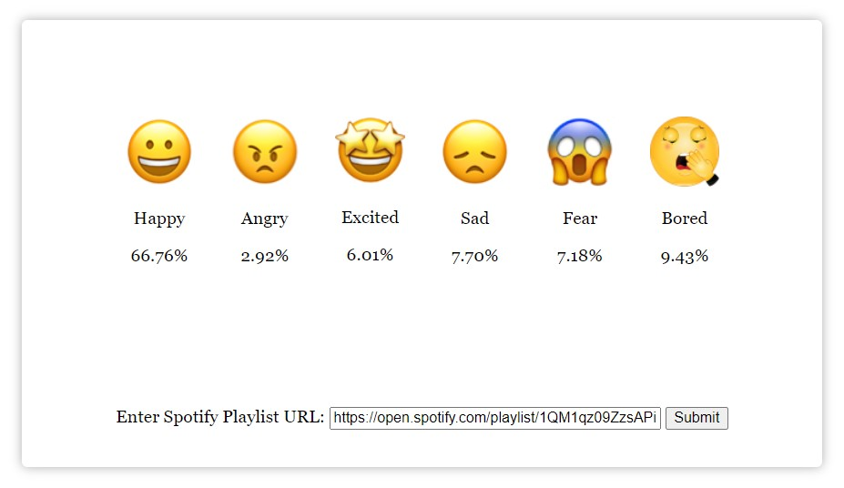

# API-APP

Submit a spotify playlist URL and get its general emotional feeling.

It is built out of the composition of following APIs:

- [Spotify](https://www.spotify.com/us/) API to get songs of the playlist.

- [Musixmatch](https://www.musixmatch.com/) API to get each song's lyric.

- [Paralleldots](https://www.paralleldots.com/text-analysis-apis) Text Analysis API to get playlist's sentiment.

